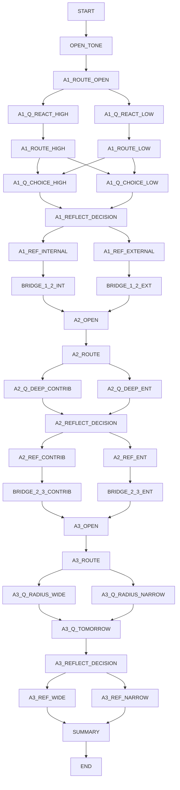

# Reflection Tree Diagram

```mermaid
flowchart TD
    START --> OPEN_TONE
    OPEN_TONE --> A1_ROUTE_OPEN

    A1_ROUTE_OPEN --> A1_Q_REACT_HIGH
    A1_ROUTE_OPEN --> A1_Q_REACT_LOW

    A1_Q_REACT_HIGH --> A1_ROUTE_HIGH
    A1_Q_REACT_LOW --> A1_ROUTE_LOW

    A1_ROUTE_HIGH --> A1_Q_CHOICE_HIGH
    A1_ROUTE_HIGH --> A1_Q_CHOICE_LOW
    A1_ROUTE_LOW --> A1_Q_CHOICE_HIGH
    A1_ROUTE_LOW --> A1_Q_CHOICE_LOW

    A1_Q_CHOICE_HIGH --> A1_REFLECT_DECISION
    A1_Q_CHOICE_LOW --> A1_REFLECT_DECISION
    A1_REFLECT_DECISION --> A1_REF_INTERNAL
    A1_REFLECT_DECISION --> A1_REF_EXTERNAL

    A1_REF_INTERNAL --> BRIDGE_1_2_INT
    A1_REF_EXTERNAL --> BRIDGE_1_2_EXT
    BRIDGE_1_2_INT --> A2_OPEN
    BRIDGE_1_2_EXT --> A2_OPEN

    A2_OPEN --> A2_ROUTE
    A2_ROUTE --> A2_Q_DEEP_CONTRIB
    A2_ROUTE --> A2_Q_DEEP_ENT
    A2_Q_DEEP_CONTRIB --> A2_REFLECT_DECISION
    A2_Q_DEEP_ENT --> A2_REFLECT_DECISION
    A2_REFLECT_DECISION --> A2_REF_CONTRIB
    A2_REFLECT_DECISION --> A2_REF_ENT

    A2_REF_CONTRIB --> BRIDGE_2_3_CONTRIB
    A2_REF_ENT --> BRIDGE_2_3_ENT
    BRIDGE_2_3_CONTRIB --> A3_OPEN
    BRIDGE_2_3_ENT --> A3_OPEN

    A3_OPEN --> A3_ROUTE
    A3_ROUTE --> A3_Q_RADIUS_WIDE
    A3_ROUTE --> A3_Q_RADIUS_NARROW
    A3_Q_RADIUS_WIDE --> A3_Q_TOMORROW
    A3_Q_RADIUS_NARROW --> A3_Q_TOMORROW
    A3_Q_TOMORROW --> A3_REFLECT_DECISION
    A3_REFLECT_DECISION --> A3_REF_WIDE
    A3_REFLECT_DECISION --> A3_REF_NARROW

    A3_REF_WIDE --> SUMMARY
    A3_REF_NARROW --> SUMMARY
    SUMMARY --> END
```
